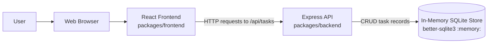
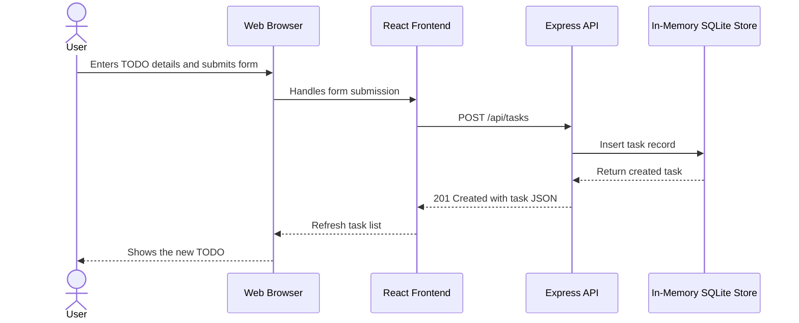

# Cloud Architecture Overview

## System Context

This monorepo contains a simple full-stack TODO application with a React frontend, an Express API, and an in-memory SQLite data store. The system is intended for local development and bootcamp exercises rather than production cloud deployment.

## Components

- **React frontend**: Provides the TODO user interface and sends task operations to the API.
- **Express API**: Exposes task endpoints for listing, creating, updating, completing, and deleting tasks.
- **In-memory SQLite store**: Holds task data only for the lifetime of the backend process.

## Creating a TODO

## Runtime Notes

- The root workspace starts the frontend and backend together with `npm run start`.
- API calls are made under `/api/tasks` from the frontend.
- Data is not durable because the SQLite database is initialized in memory when the backend starts.
